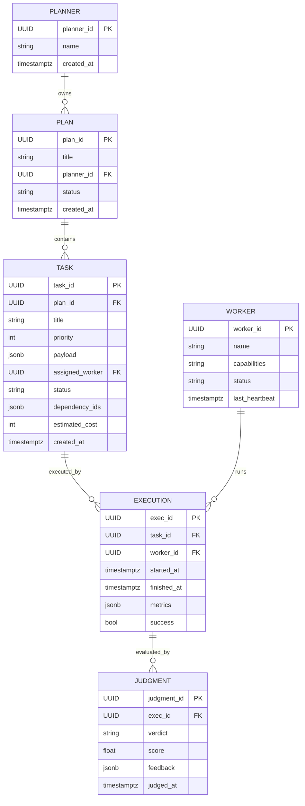
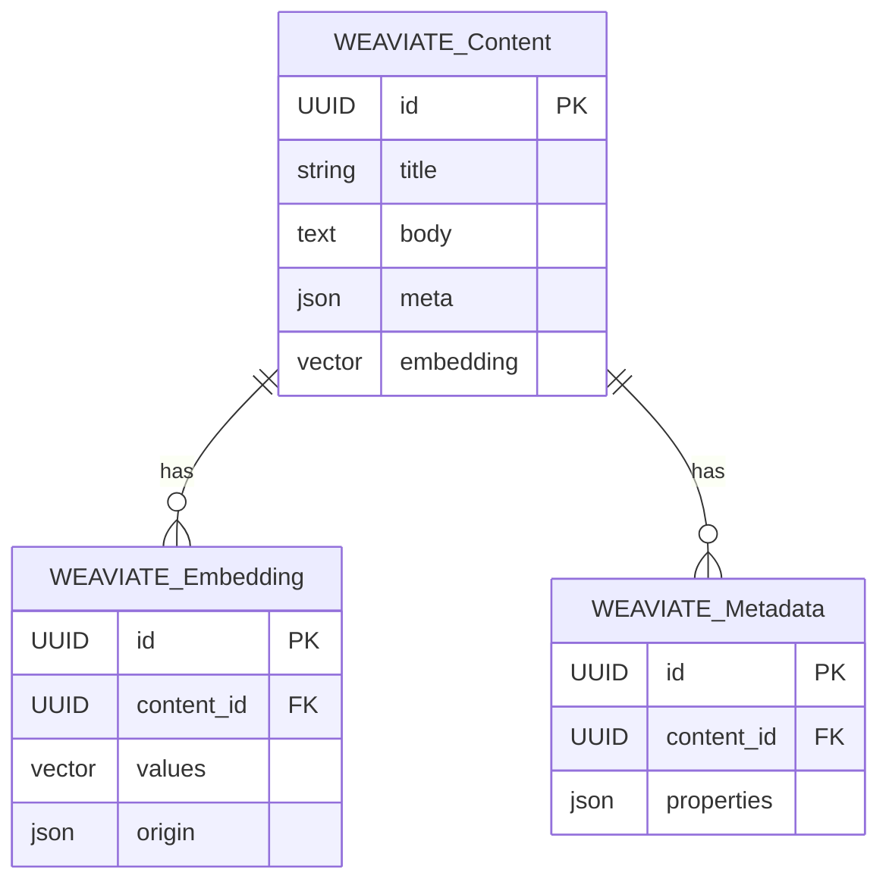

# Technical Specifications — DB Schemas & Planner → Worker Pool API

## Mermaid ERD — PostgreSQL schema

## Mermaid ERD — Weaviate schema (conceptual)

Notes:
- PostgreSQL stores plan/task lifecycle, execution details, and judgment records; Weaviate stores dense vectors and searchable content objects referenced by task payloads.

---

## JSON API Contract — Planner → Worker Pool ('Content Request')

- Endpoint: `POST /api/v1/worker-pool/content-requests`
- Auth: `Authorization: Bearer <token>`
- Content-Type: `application/json`
- Idempotency: optional `Idempotency-Key` header supported

Request JSON Schema (application/json):

{
  "planner_id": "uuid",          // origin planner
  "plan_id": "uuid",             // parent plan
  "task": {
    "task_id": "uuid",           // client-generated or server-assigned
    "title": "string",
    "priority": 1,                 // integer (higher = earlier)
    "dependencies": ["uuid"],    // optional
    "deadline": "ISO8601",       // optional
    "payload": {                   // task-specific content request
      "type": "content_generation|fetch|transform",
      "content_spec": { /* domain specific */ },
      "weaviate_refs": [ { "class": "Content", "id": "uuid" } ]
    }
  },
  "meta": {                        // optional routing/observability
    "callback_url": "https://...",
    "trace_id": "string"
  }
}

Minimal validation rules:
- `planner_id`, `plan_id`, and `task.task_id` must be valid UUIDs when present.
- `task.payload.type` must be one of the allowed values.

Success responses:
- 201 Created (synchronous acceptance)

Example 201 body:

{
  "status": "accepted",
  "task_id": "uuid",
  "queue_position": 12,
  "accepted_at": "2026-02-05T12:00:00Z"
}

- 202 Accepted (async processing; task queued)

Example 202 body:

{
  "status": "queued",
  "task_id": "uuid",
  "estimated_start": "2026-02-05T12:05:00Z"
}

Error responses:
- 400 Bad Request — malformed JSON or missing required fields.
- 401 Unauthorized — invalid or missing auth token.
- 409 Conflict — idempotency conflict for same `Idempotency-Key`.
- 422 Unprocessable Entity — schema validation failed (include `errors` list).

Failure example (422):

{
  "status": "error",
  "errors": [ { "field": "task.payload.type", "message": "unknown type" } ]
}

Behavioral contract / lifecycle:
- Upon valid request the Worker Pool returns a task identifier and queue info.
- The Worker Pool will persist the request to PostgreSQL (`TASK`) linking to `PLAN`.
- If the payload references Weaviate objects, the Worker Pool SHOULD dereference or validate references prior to execution and record any missing refs in `TASK.payload` metadata.
- On task completion the Worker Pool POSTs the execution result to the Judge API (separate contract) including `exec_id`, `task_id`, `logs`, and `metrics`.

Idempotency & retries:
- Clients should set `Idempotency-Key` for at-least-once safe retries; Worker Pool must return the same `task_id` for repeated idempotent requests.

Observability & tracing:
- Support `traceparent` or `trace_id` in `meta` for cross-system tracing.

---

Files created:
- See [specs/technical.md](specs/technical.md) for this content.
